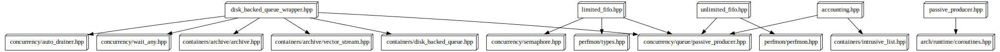

# Cpp Dependency Graph

Generates useful component dependency visualisations (`dot` or `d3.js`) to study the architecture of C/C++ projects.

Why do all the other languages have awesome tools to analyse codebases but C/C++ codebases do not?

It's time to change that.

This tool aims to -

- provide multiple views into the architecture of a codebase
- generate views at multiple levels of the architecture
- make the resulting views genuinely useful, rich, dynamic and interactive (static views are boring)

## Inspiration

This tool is inspired by a number of projects [rubrowser](http://www.emadelsaid.com/rubrowser/), [cpp-dependencies](https://github.com/tomtom-international/cpp-dependencies) and [objc-dependency-visualizer](https://github.com/PaulTaykalo/objc-dependency-visualizer).

The pretty `d3` visualisations are directly copied from `objc-dependency-visualiser`.

A huge shout out to the people behind these projects.

## Comparison With Other Tools

### cpp-dependencies

### cinclude2dot

### dep-matrix

## Usage

### Installation

`gem install cpp_dependency_graph`

### Help

`cpp_dependency_graph -h`

### Overall component dependency graph

To generate the overall component depenency graph for a project, use it like so -

`cpp_dependency_graph visualise -r spec\test\example_project\ -o deps.dot -f dot`

Below is the overall `dot` and `d3` component dependency visualisations for [leveldb](https://github.com/google/leveldb)

**NOTE** - If your project has a large number of components (> 100 and lots of connections between them), then generation (and subsequent rendering) may take some time.

### Individual component dependency graph

This will highlight the dependencies coming in and going out of a specific component. This allows you to filter out extraneous detail and study individual components in more detail.

`cpp_dependency_graph visualise -r spec\test\example_project\ -c Engine -o deps.dot -f dot`

Here's a component dependency visualisation generated for the `queue` component in [rethinkdb](https://github.com/rethinkdb/rethinkdb)

### Component include dependency graph

This will highlight dependencies of includes within a specific component

`cpp_dependency_graph visualise_includes -r spec\test\example_project\ -c Engine`

Here's a component include dependency visualisation generated for the `queue` component in [rethinkdb](https://github.com/rethinkdb/rethinkdb)

### Cyclic dependencies only graph

This will highlight cyclic dependencies between components within a project. This is especially useful for targeted refactoring activities to reduce coupling between components.

`cpp_dependency_graph visualise_cyclic_deps -r spec\test\example_project\`

Here's the cyclic dependencies only visualisation generated for [rethinkdb](https://github.com/rethinkdb/rethinkdb) and [leveldb](https://github.com/google/leveldb)

## Development

`bundle exec cpp_dependency_graph visualise -r <dir>`

## License

cpp_dependency_graph is available under the MIT license.

## Warranty

This software is provided "as is" and without any express or implied
warranties, including, without limitation, the implied warranties of
merchantability and fitness for a particular purpose.
