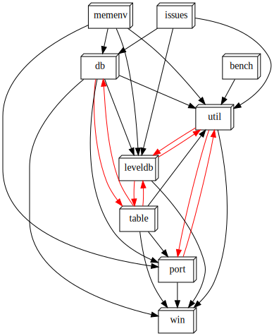

# Cpp Dependency Graph

Generates useful component dependency visualisations (`dot` or `d3.js`) to study the architecture of C/C++ projects.

Why do all the other languages have awesome tools to analyse codebases but C/C++ does not?

It's time to change that.

This tool aims to -

- provide multiple views into the architecture of a codebase
- generate views at multiple levels of the architecture
- make the resulting views genuinely useful, rich, dynamic and interactive (static views are boring)

## Inspiration

This tool is inspired by a number of projects [rubrowser](http://www.emadelsaid.com/rubrowser/), [cpp-dependencies](https://github.com/tomtom-international/cpp-dependencies) and [objc-dependency-visualizer](https://github.com/PaulTaykalo/objc-dependency-visualizer).

The pretty `d3` visualisations are directly copied from `objc-dependency-visualiser`.

A huge shout out to the people behind these projects.

## Usage tutorial
### Overall component dependency graph

To generate the overall component dependency graph for a project, use it like so -

`cpp_dependency_graph visualise -r spec\test\example_project\ -o deps.dot -f dot`

Below is the overall `dot` and `d3` component dependency visualisations for [leveldb](https://github.com/google/leveldb)

